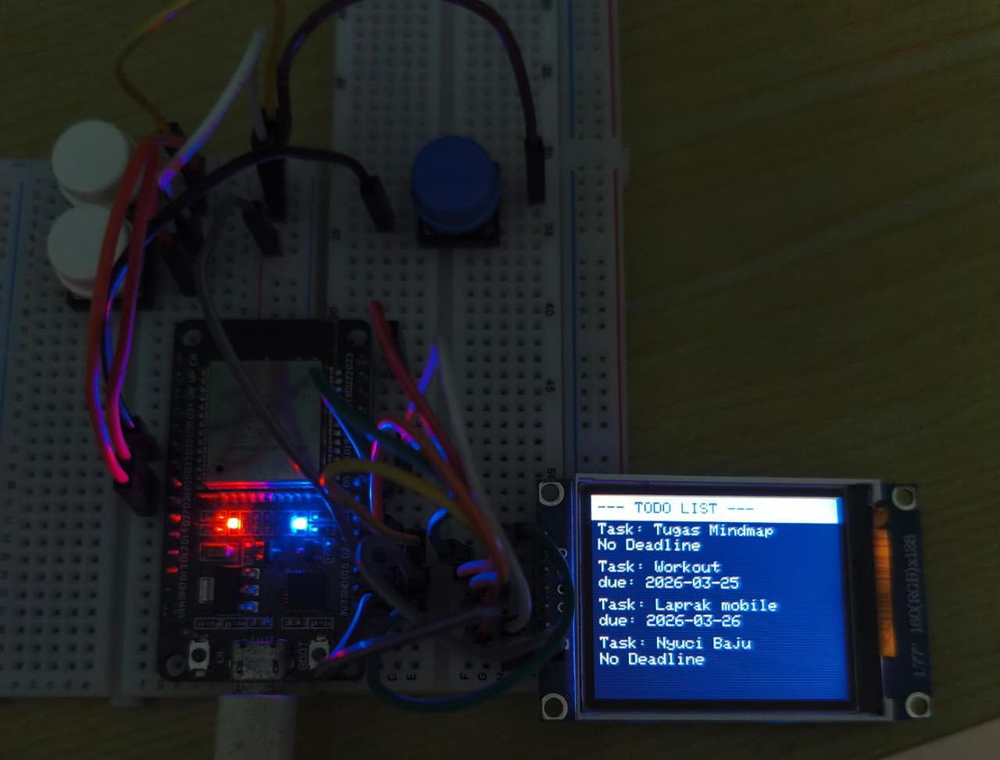

# ESP32 Google Tasks ToDo LCD

A compact ToDo list device using **ESP32 + TFT LCD** that integrates with **Google Tasks API** through **Google Apps Script**.

The ESP32 fetches tasks from a specific Google Tasklist and displays them on the screen. You can also mark a task as completed using physical buttons.

## Working project image demo:



## Features

- Show tasks from a specific Google Tasklist on a TFT screen.
- Fetch task data from Google Tasks API via Google Apps Script (`Kode.gs`).
- Mark a selected task as complete directly from the ESP32 using a button.
- Refresh task list from device UI.

## How It Works

1. ESP32 connects to Wi-Fi.
2. ESP32 sends HTTP GET request to deployed Google Apps Script Web App (`SCRIPT_URL`).
3. Apps Script (`Kode.gs`) handles:
   - `action=fetchTask` -> read tasks from Tasklist named `ESP`.
   - `action=completeTask&id=<task_id>` -> mark selected task as completed.
4. ESP32 parses JSON response and renders task rows on TFT.

## Project Structure

- `src/main.cpp`: ESP32 firmware (UI, buttons, HTTP calls, rendering).
- `Kode.gs`: Google Apps Script backend for Google Tasks integration.
- `platformio.ini`: PlatformIO environment, board config, libraries, TFT pin setup.
- `private_vars_example.ini`: template for secret build flags.
- `private_vars.ini`: local secret values (Wi-Fi + script URL).

## Hardware

- ESP32 dev board
- TFT display (configured with `TFT_eSPI`, ST7735 driver)
- 3 buttons (UP, DOWN, SELECT)

Button pins in `src/main.cpp`:

- `UP`: GPIO 26
- `DOWN`: GPIO 25
- `SELECT`: GPIO 32

TFT pins are configured in `platformio.ini` via build flags.

## Software Requirements

- [PlatformIO](https://platformio.org/)
- Arduino framework for ESP32
- Google account with Google Tasks enabled
- Google Apps Script project with Google Tasks advanced service enabled

Libraries (from `platformio.ini`):

- `TFT_eSPI`
- `Blynk` (currently included as dependency)
- `ArduinoJson`

## Setup

### 1) Configure Google Apps Script

1. Open `Kode.gs` and create/deploy as a Web App.
2. Ensure Google Tasks service is enabled for the script project.
3. In Google Tasks, create a task list named `ESP` (or update `listName` in script).
4. Deploy Web App and copy deployment URL.

### 2) Configure Secrets

Create `private_vars.ini` (or update existing) based on `private_vars_example.ini`:

```ini
[secrets]
build_flags =
  -D WIFI_SSID=\"YOUR_WIFI\"
  -D WIFI_PASS=\"YOUR_WIFI_PASSWORD\"
  -D SCRIPT_URL=\"YOUR_DEPLOYED_APPS_SCRIPT_URL\"
```

`platformio.ini` already loads it via:

```ini
[platformio]
extra_configs = private_vars.ini
```

### 3) Build and Upload

From project root:

```bash
pio run
pio run -t upload
pio device monitor
```

## Usage

- Power on ESP32.
- Device connects to Wi-Fi and fetches tasks.
- Use buttons:
  - `UP` / `DOWN` to move highlight.
  - `SELECT` on a task to mark complete.
  - `SELECT` on header row (`--- TODO LIST ---`) to refresh list.

## Current Limitation

- Only **4 tasks** can be shown due to current screen layout and size.
- Future improvement: implement scrolling or pagination.

## API Response Format

From Apps Script to ESP32 (minified fields for small payload):

- `i`: task id
- `t`: task title
- `d`: due date

Example:

```json
[{ "i": "task_id_1", "t": "Buy milk", "d": "2026-03-25T00:00:00.000Z" }]
```

Complete task response:

```json
{ "s": true }
```

Or on failure:

```json
{ "s": false, "e": "Error message" }
```

## Notes

- HTTPS certificate validation is disabled in firmware (`client.setInsecure()`), which is practical for quick prototyping but less secure for production use.
- Serial monitor baud rate is set to `9600`.
